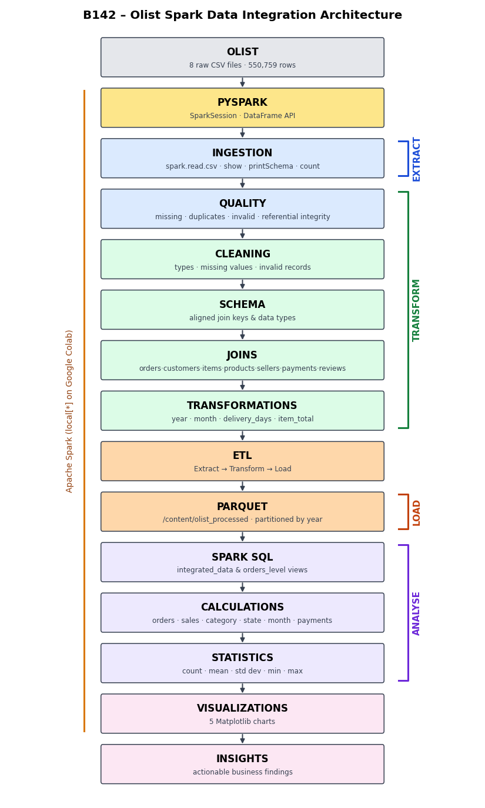

# B142 Data Integration – E-Commerce Data Integration and Scalable Analytics Using Apache Spark

## Project objective
Integrate the Olist Brazilian e-commerce data, which is spread across multiple CSV files, into one reliable analytical dataset using **Apache Spark**, and use **Spark SQL** to produce actionable business insights.

## Dataset / source
**Olist Brazilian E-Commerce Public Dataset** – Kaggle: https://www.kaggle.com/datasets/olistbr/brazilian-ecommerce
About 100,000 orders placed between 2016 and 2018.

## Technologies
Python · Apache Spark 3.5 (PySpark DataFrame API) · Spark SQL · Parquet · Matplotlib · Google Colab · GitHub

## Dataset structure
| Dataset | Rows | Columns | Key(s) |
|---|---:|---:|---|
| customers | 99,441 | 5 | customer_id |
| orders | 99,441 | 8 | order_id, customer_id |
| order_items | 112,650 | 7 | order_id, product_id, seller_id |
| payments | 103,886 | 5 | order_id |
| reviews | 99,224 | 7 | order_id |
| products | 32,951 | 9 | product_id |
| sellers | 3,095 | 4 | seller_id |
| category_translation | 71 | 2 | product_category_name |

```
customers ─customer_id─> orders ─order_id─> order_items ─product_id─> products
                           │ └─order_id─> payments        └─seller_id─> sellers
                           └───order_id─> reviews
```

## ETL pipeline


| Stage | Steps |
|---|---|
| **Extract** | read 8 raw CSV files with `spark.read.csv` (schema inference off) |
| **Transform** | quality assessment → cleaning → missing values → schema alignment → joins → derived fields |
| **Load** | write `integrated_data` to Parquet partitioned by `purchase_year` |

## Cleaning

- Dates changed to `timestamp` prices/payments changed to `double` review score changed to `int`.

- Missing delivery dates kept ( orders) and not used in delivery metrics.

- 610 Missing product categories added as `unknown`; categories translated into English.

- 9 Invalid payments (value 0 / `not_defined`) taken out.

- Review comment columns removed (not looked at).
- 
## Integration
Process
I performed a step-by-step join of the tables with row counts, a schema and an example for each join. Aggregated the payments and reviews so that they contribute only one row to the joined table. Validated that 112,650 rows and 98,666 orders, 32,951 products and 3,095 sellers have been included – same as in the source tables. The SUM(price) matched that of the source, and a naive join would have inflated sales by 4.0%.

## Transformations
`purchase_year`, `purchase_month`, `year_month`, `delivery_days`, `delivered_late`, `item_total = price + freight_value`.

## Parquet

Output: `/content/olist_processed/` split by `purchase_year` into three partitions. When read back with Spark, the row count and data types remain the same.

## Spark SQL

Two views exist: `integrated_data` at the item level and `orders_level` at the order level. When counting orders always use `COUNT(DISTINCT order_id)`. Refer to the order-level view.

## Calculations

Overall KPIs:

· orders, sales and average price by category

· orders, value and delivery by state

· orders and value by month

· count and value by payment type

· review score and its distribution

· average and median delivery days

· count mean standard deviation, minimum and maximum

· financial checks, against source tables.

## Visualizations
| Chart | File |
|---|---|
| 1. Monthly order volume | `charts/chart1_monthly_orders.png` |
| 2. Sales by product category | `charts/chart2_sales_by_category.png` |
| 3. Orders by customer state | `charts/chart3_orders_by_state.png` |
| 4. Average delivery days by state | `charts/chart4_delivery_days_by_state.png` |
| 5. Payment type distribution | `charts/chart5_payment_types.png` |

## Results
| Metric | Value |
|---|---|
| Orders / customers | 98,199 / 94,983 |
| Sellers / products | 3,053 / 32,729 |
| Product sales / freight | R$ 13.49M / R$ 2.24M |
| Average order value | R$ 160.24 (median R$ 105.28) |
| Top category | health_beauty – 9.31% of sales |
| Top state | SP – 41.88% of orders |
| Peak month | November 2017 – 7,421 orders |
| Credit card share | 73.93% (avg 3.51 instalments) |
| Delivery | average 12.56 days, median 10.22, 8.11% late |
| Review score | average 4.1 |

Highlights: 1. Late delivers are on average 2.57 stars vs 4.29 (54.1% vs 9.2%) for on-time delivers. 2. SP receives orders in 8.8 days vs up to 29.4 days for the northern states. 

3. SP + RJ + MG = 66.5% of orders, the 5 most popular categories = 39.8% of sales 4. 

Big seasonal spike in November (Black Friday) 5. 1.03 orders per customer – very low repeat purchase.
## How to run
**Google Colab (recommended)**
1. Open `B142_Olist_Data_Integration.ipynb` in Google Colab.
2. Either upload the Olist CSV files to `/content`, or do nothing – the notebook downloads them with `kagglehub`.
3. `Runtime → Run all`.

**Locally** (Java 11/17 required)
```bash
pip install -r requirements.txt
mkdir data          # copy the Olist CSV files here
jupyter notebook B142_Olist_Data_Integration.ipynb
```

## Repository structure
```
B142-Olist-Data-Integration/
├── B142_Olist_Data_Integration.ipynb   # full Spark pipeline with outputs
├── README.md
├── requirements.txt
├── architecture.png
├── charts/                             # 5 charts produced by the notebook
└── report/
    └── B142_Olist_Data_Integration_Report.pdf
```
